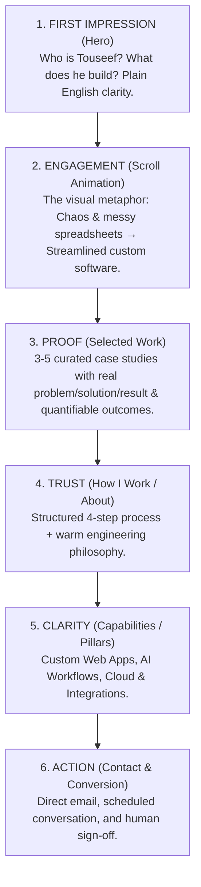

# Portfolio Redesign — Design Audit & Implementation Plan

This document provides a comprehensive design audit of the existing codebase (`touseefspace`) against the strategic foundation set forth in [design_priciples.md](file:///c:/Users/Hp/Desktop/Workspace/Portfolio%20Site/touseefspace/design_priciples.md), followed by an architectural and technical execution roadmap across 22 critical dimensions.

---

## 1. Executive Assessment

The current codebase is a modern Next.js 16 + Payload CMS 3 application configured with Tailwind CSS v4 and Framer Motion 12. Technically, the underlying data layer (Payload CMS with PostgreSQL/Supabase, S3 media uploads, and server-side tag caching) provides a strong foundation for managing content. 

However, from an **editorial, UX, and brand positioning standpoint**, the current site behaves like a conventional, template-driven "developer portfolio" cluttered with trendy micro-interactions, rather than a restrained, high-credibility presentation of a senior software developer who solves complex business problems.

### Key Strengths of Current Codebase:
1. **Robust Content Engine**: Payload CMS 3 is already wired up with collections for Projects, Experiences, Skills, and Globals.
2. **Modern Server Framework**: Next.js 16 with React 19 server components and `"use cache"` tags.
3. **Clean Baseline Tech Stack**: Fast build times, modern bundler, sharp image optimization.

### Core Failures Against Design Principles:
1. **Lack of Editorial Typography**: The site currently defaults to uncurated system fonts (`font-family: Arial, Helvetica, sans-serif;` in [globals.css](file:///c:/Users/Hp/Desktop/Workspace/Portfolio%20Site/touseefspace/app/globals.css#L33)), missing the Swiss design typography ethos (Inter/Geist editorial hierarchy).
2. **Absence of Signature Scroll Narrative**: The signature scroll-driven animation requested in `design_principles.md` (visualizing *Disorganized manual process → Connected system → Finished application*) does not exist. It is replaced by a 1px vertical scaling line and a music-player-style auto-rotating project carousel.
3. **Gimmicky Gimmicks vs. Restraint**: The UI features a floating draggable bubble (`FloatingSocialDock`) with a pulsing neon gradient and spinning rings, auto-advancing 7-second project timers with play/pause buttons, and mouse-follow spotlights that hide project titles on hover. This violates Dieter Rams's principle of "as little design as possible" and Apple HIG's minimal chrome.
4. **Weak Project Presentation**: Projects are displayed as shallow cards with tech badges and hover overlays. There are no structured case studies (`Problem → Solution → Outcome`, metrics, architecture diagrams, role, learnings) and no dynamic case-study detail routes (`/work/[slug]`).
5. **Fragmented Navigation**: 5 separate pages in a sticky navbar (`Home`, `Skills`, `Projects`, `Experiences`, `Contact`) that break the visitor's linear storytelling journey, accompanied by developer scaffolding copy left visible on the public homepage (*"Payload CMS is now the editing home..."*).

---

## 2. Current-State Technical & UX Audit

### Architecture & Framework
* **Next.js 16.2.3 / React 19.2.4**: App Router with Turbopack and React Server Components.
* **Payload CMS 3.84.1**: Integrated via `@payloadcms/next/withPayload` in [next.config.ts](file:///c:/Users/Hp/Desktop/Workspace/Portfolio%20Site/touseefspace/next.config.ts), backed by PostgreSQL (`@payloadcms/db-postgres`) and Supabase S3 storage.
* **Styling**: Tailwind CSS v4 (`@tailwindcss/postcss`) imported in [globals.css](file:///c:/Users/Hp/Desktop/Workspace/Portfolio%20Site/touseefspace/app/globals.css). Hardcoded dark colors (`#030712`, `#111827`) with hyper-saturated indigo (`#818cf8`) and rose (`#fb7185`).
* **Motion**: Framer Motion 12 installed. Used for ad-hoc spring animations, drag handles, and marquee shimmers.
* **Font Loading**: None configured. Uses unstyled browser system fallback.

### Content & Route Inventory
* **`/` ([page.tsx](file:///c:/Users/Hp/Desktop/Workspace/Portfolio%20Site/touseefspace/app/page.tsx))**: Renders `HomeScrollShowcase` containing:
  * Hero with missing portrait placeholder (*"Portrait Missing... Upload your image in Globals → Home"*).
  * Proof points strip (`Core stack`, `Current focus`, `Location`).
  * Rotating spotlight deck (auto-playing carousel).
  * Single latest experience card.
  * 4x2 grid of skill icons.
  * Scaffolding callout box linking to `/admin`.
* **`/projects` ([page.tsx](file:///c:/Users/Hp/Desktop/Workspace/Portfolio%20Site/touseefspace/app/projects/page.tsx))**: Renders `ProjectSpotlightList`. Hovering over a project makes the title and tech stack translate up and disappear (`opacity: 0`), replacing it with a 2-line summary. No individual case study detail page exists.
* **`/skills` ([page.tsx](file:///c:/Users/Hp/Desktop/Workspace/Portfolio%20Site/touseefspace/app/skills/page.tsx))**: Displays skill category boxes with arbitrary percentage progress bars (e.g. `React 90%`), which reduces credibility.
* **`/experiences` ([page.tsx](file:///c:/Users/Hp/Desktop/Workspace/Portfolio%20Site/touseefspace/app/experiences/page.tsx))**: Displays Work and Education timelines. Functional, but disconnected from business outcomes.
* **`/contact` ([page.tsx](file:///c:/Users/Hp/Desktop/Workspace/Portfolio%20Site/touseefspace/app/contact/page.tsx))**: Displays a grid of external social links. No direct contact form or structured inquiry flow.
* **Global Layout Elements**:
  * [Navbar.tsx](file:///c:/Users/Hp/Desktop/Workspace/Portfolio%20Site/touseefspace/components/Navbar.tsx): Sticky glass navbar with animated shimmer line, 5 page links, and GitHub button.
  * [FloatingSocialDock.tsx](file:///c:/Users/Hp/Desktop/Workspace/Portfolio%20Site/touseefspace/components/FloatingSocialDock.tsx): Draggable floating widget with pulsing animations that obscures page content.
  * [Footer.tsx](file:///c:/Users/Hp/Desktop/Workspace/Portfolio%20Site/touseefspace/components/Footer.tsx): Minimal footer with copyright and social links.

---

## 3. Design-Principle Comparison (Current vs. Target)

| Dimension | Current State | Target State (`design_principles.md`) | Gap | Priority |
| :--- | :--- | :--- | :--- | :--- |
| **Clarity & Positioning** | "Full stack developer building calm, useful digital systems" + developer scaffolding text. | High-clarity positioning: "Software Developer — Developing with love 💖 / I turn messy workflows into simple, reliable software." | Current copy is diffuse; lacks strong problem-solver framing. Scaffolding text must be eradicated. | **P0** |
| **Information Architecture** | 5 separate pages linked via heavy sticky navbar + floating drag bubble. | Unified narrative single-page homepage (Hero → Animation → Selected Work → Process → Pillars → Contact) + clean deep-dive case studies (`/work/[slug]`). | Page fragmentation breaks storytelling; navbar adds unnecessary visual noise. | **P0** |
| **Signature Scroll Animation** | Non-existent. Replaced by a 1px vertical line scale and an auto-rotating carousel deck. | Story-driven scrubbable transformation: Chaos (spreadsheets/emails) → Process Mapping → Architecture Wireframe → Real UI → Production Dashboard. | Core visual anchor of the portfolio is completely absent. | **P0** |
| **Project Presentation** | Shallow list with hover-to-hide titles, tech badges, and short summaries. No detail pages. | 3–5 curated, deep case studies structured as Problem → Solution → Result, with client context, metrics, architecture, and learnings. | Zero evidence of real-world business impact or depth of thought. | **P0** |
| **Typography System** | Generic system fallback (`Arial, Helvetica, sans-serif`). | Editorial Swiss typography: `Inter` or `Geist Sans` + `Geist Mono`, strict mathematical typographic scale (48px / 32px / 24px / 16px / 13px), 1.5 line height. | Unprofessional, generic feel due to default browser fonts. | **P1** |
| **Color & Aesthetic** | Dark mode with high-contrast electric indigo (`#818cf8`), rose, and heavy glows. | Editorial, calm dark mode: Neutral charcoal/slate background (`#090A0F`), subtle borders (`rgba(255,255,255,0.08)`), single warm/refined accent, generous whitespace. | Current palette feels like an AI/crypto template rather than an editorial product portfolio. | **P1** |
| **Skill Representation** | Percentage bars (`React 90%`) and laundry lists of 20+ icons. | 3 Strategic Pillars (Web Apps, AI Solutions, Systems/Integrations) focused on client outcomes; tech mentioned only as trust indicators. | Tech percentage bars diminish credibility with engineering leaders. | **P1** |
| **Navigation Chrome** | Full navbar with animated shimmer + draggable floating dock. | Minimal persistent frame: quiet brand signature top-left, clean "Let's Talk →" CTA top-right, subtle scroll indicator. | Chrome gets in the way of content; floating dock is intrusive. | **P1** |
| **Accessibility (WCAG AA)** | Hover-only content disclosure (inaccessible to keyboard/touch), missing skip link, focus rings inconsistent. | Native visible content, WCAG 2.2 AA contrast, skip-to-content link, 44px+ touch targets, full `prefers-reduced-motion` compliance. | Interactive elements fail basic touch and keyboard usability standards. | **P1** |
| **Performance & Web Vitals** | Uncached remote images, heavy bundle loading, unthrottled timer intervals. | LCP < 2.0s, CLS = 0, offscreen canvas/frame optimization for scroll animation, next/font zero-layout-shift. | Performance risk on mobile devices. | **P1** |

---

## 4. Visitor Journey & Information Architecture

### The Visitor Journey Funnel


### Recommended Information Architecture
1. **Homepage (`/`)**: A seamless, high-rhythm vertical scroll narrative containing the entire core story.
2. **Case Studies (`/work/[slug]`)**: Dedicated deep-dive editorial pages for major projects (e.g. MISBAH ERP / Aunvu ERP, AI Automation Tool, Client Portal) linked from the homepage.
3. **Legacy Route Handling**:
   * Redirect `/projects` → Homepage `#work` (or keep as an exhaustive archive of secondary experiments).
   * Consolidate `/skills` and `/experiences` into the homepage narrative flow and case studies to eliminate shallow satellite pages.
   * Direct `/contact` into the high-conversion contact section or dedicated streamlined inquiry view.

---

## 5. Exact Homepage Section-by-Section Blueprint

### SECTION 01 — HERO
* **Purpose**: Establish identity, technical credibility, and human warmth within 3 seconds.
* **Visitor Question Answered**: *"What does this person actually do, and why should I care?"*
* **Content**:
  * Eyebrow: `Touseef Ahmed` · `Software Developer`
  * Primary Headline: `I turn messy workflows into simple, reliable software.`
  * Strapline / Subhead: `Developing with love 💖 — focused on custom web applications and AI-powered systems for businesses.`
  * Proof Strip: Micro-stats (`Location: United Arab Emirates`, `Specialization: Web Apps & AI Systems`, `Availability: Open for Q2/Q3 projects`).
  * CTAs: Primary `[See My Work ↓]` (smooth scrolls to `#work`), Secondary `[Let's Talk →]` (opens contact drawer/section).
* **Visual Treatment**: Generous whitespace (min 120px top padding), pristine typography, optional subtle subtle portrait or editorial stamp.
* **Layout**: Asymmetric desktop grid (7-col content / 5-col visual or centered editorial composition).
* **Typography**: H1 clamp (42px to 64px), font-weight 700, letter-spacing -0.03em.
* **Interaction**: Hover micro-interactions on CTAs; keyboard accessible.
* **Reduced Motion**: Static entrance with zero layout shift.

---

### SECTION 02 — SIGNATURE SCROLL ANIMATION (Workflow Transformation)
* **Purpose**: Visually demonstrate the core value proposition: taking manual, fragmented operational chaos and consolidating it into an intuitive, high-performance web application.
* **Visitor Question Answered**: *"Can he actually take a complex, messy problem and engineer a clean solution?"*
* **Content**:
  * Stage 1: `The Chaos` — Scattered spreadsheets, unread email threads, siloed messages, lost paper invoices.
  * Stage 2: `The Mapping` — Structured pipelines, API connections, database relations linking entities together.
  * Stage 3: `The Architecture` — Clean modular system wireframe with real-time sync.
  * Stage 4: `The Product` — Crisp, responsive business dashboard with live metrics and automated workflows.
  * Overlay Text Caption: Sticky side/bottom editorial caption that scrubs cleanly with the visuals.
* **Visual Treatment**: Clean vector/canvas rendering or crisp WebP image sequence framed inside a sleek, dark device shell.
* **Layout**: Pinned viewport (`100vh`) with a scroll track of ~1800px.
* **Performance**: Optimized HTML5 `<canvas>` rendering driven by scroll progress via `requestAnimationFrame`. Zero lag, no DOM bloat.
* **Mobile Behavior**: Fallback to a streamlined 3-step static card comparison or reduced-frame scrub with touch optimization.
* **Reduced Motion**: A single side-by-side Before/After architectural diagram (`prefers-reduced-motion: reduce`).

---

### SECTION 03 — SELECTED WORK (Case Studies Preview)
* **Purpose**: Provide undeniable proof of execution through 3–4 curated flagship systems.
* **Visitor Question Answered**: *"What real products has he built, and what were the tangible business outcomes?"*
* **Content**:
  * Project 01: **MISBAH / Aunvu ERP** — Multi-branch inventory, sales, and automated reporting system.
  * Project 02: **AI Workflow & Automation Suite** — Custom LLM-backed document parser and operational tool.
  * Project 03: **Custom Cloud Client Portal** — High-performance SaaS application with real-time collaboration.
  * Each Entry Includes:
    * Project index (`01`, `02`, `03`)
    * Client/Industry Context & Role
    * Core Problem Statement (1–2 sentences)
    * Solution & Key Engineering Decision
    * Measurable Outcome (e.g. *"Reduced order reconciliation time by 80%"*)
    * One large, pristine UI screenshot / device mockup
    * Direct link: `[Read Full Case Study →]`
* **Visual Treatment**: Alternating or stacked editorial cards with generous breathing room (80px+ vertical gap). No titles disappearing on hover.
* **Layout**: 12-column Swiss grid: 5 columns for narrative text/metrics, 7 columns for the high-res UI asset.

---

### SECTION 04 — HOW I WORK (Process & Philosophy)
* **Purpose**: De-risk working with Touseef by showing a disciplined, transparent 4-stage delivery process.
* **Visitor Question Answered**: *"What is it like to collaborate with him? Is he reliable?"*
* **Content**:
  * Step 01: `01 / Discover & Map` — Uncovering the bottleneck, auditing workflows, defining business requirements.
  * Step 02: `02 / Architecture & UI` — Crafting clean system schemas, interface ergonomics, and rapid prototypes.
  * Step 03: `03 / Engineering & AI` — Building reliable full-stack code with Next.js, robust databases, and intelligent automations.
  * Step 04: `04 / Deploy & Iterate` — Automated testing, cloud deployment, and hands-on operational training.
* **Visual Treatment**: 4-column minimal card grid or horizontal numbered rail with clean hairline dividers.

---

### SECTION 05 — CAPABILITIES & STACK (Three Strategic Pillars)
* **Purpose**: Position technical skills around business outcomes rather than a generic developer skill cloud.
* **Visitor Question Answered**: *"What domains does he specialize in?"*
* **Content**:
  * Pillar 1: **Custom Web Applications** — High-performance web apps, internal operational tools, ERPs, and client portals built with React, Next.js, and TypeScript.
  * Pillar 2: **AI & Automation Workflows** — Practical LLM integrations, intelligent document extraction, automated pipelines, and custom agents.
  * Pillar 3: **Cloud Architecture & Integrations** — PostgreSQL, Supabase, Payload CMS, REST/GraphQL APIs, and resilient serverless deployments.
* **Visual Treatment**: 3 structured cards with crisp icons, clear value descriptions, and a small, understated list of core technologies at the base.

---

### SECTION 06 — ABOUT & BACKGROUND
* **Purpose**: Humanize the developer; reinforce personal dedication and craft.
* **Visitor Question Answered**: *"Who is the person behind the code?"*
* **Content**:
  * Brief narrative: Based in the UAE, passionate about craftsmanship, building software that feels effortless to use.
  * Highlights: Professional milestones, formal computer science foundation, open-source mindset.
* **Visual Treatment**: Editorial typography paired with an authentic workspace photo or high-fidelity headshot.

---

### SECTION 07 — CONTACT / LET'S TALK
* **Purpose**: Frictionless conversion for potential clients and collaborators.
* **Visitor Question Answered**: *"How do I start a conversation with him?"*
* **Content**:
  * Direct headline: `Have something worth building?`
  * Subtext: `Whether you need an end-to-end custom application or want to automate a manual business workflow, my inbox is open.`
  * Direct Email Action: `touseefspace@gmail.com` with quick-copy button.
  * Simple Inquiry Form: Name, email, project summary (connected to Payload/Nodemailer).
  * Social Proof & Location: Based in the United Arab Emirates · GitHub · LinkedIn.

---

## 6. Signature Scroll Animation Specification

### Narrative Arc & Storyboard
The animation represents the core transformation Touseef provides: converting business friction into seamless software.

```
SCROLL PROGRESS (%)
  0% ──────────────── 25% ──────────────── 50% ──────────────── 75% ──────────────── 100%
  ┌──────────────┐     ┌──────────────┐     ┌──────────────┐     ┌──────────────┐     ┌──────────────┐
  │   CHAOS      │ ──> │   CONNECT    │ ──> │  WIREFRAME   │ ──> │  UI REVEAL   │ ──> │  DASHBOARD   │
  │ Spreadsheets │     │ Pipeline     │     │ System       │     │ Data & KPIs  │     │ "One System  │
  │ & Paperwork  │     │ Mapping      │     │ Architecture │     │ Come Alive   │     │ For All"     │
  └──────────────┘     └──────────────┘     └──────────────┘     └──────────────┘     └──────────────┘
```

### Technical Architecture
1. **Engine**: HTML5 `<canvas>` paired with Next.js image caching and a lightweight scroll-scrubbing controller (using Framer Motion `useScroll` or lightweight native scroll observer with `requestAnimationFrame`).
2. **Asset Format**: 36 optimized WebP keyframes (1280×720 at ~45KB each, total budget < 1.6MB) or SVG vector morphing paths rendered directly onto canvas.
3. **Progressive Loading**:
   * Preload Frame 0 (initial state) and Frame 35 (final state) in the HTML `<head>`.
   * Load intermediary frames progressively using `createImageBitmap()` in a Web Worker or async background decode.
4. **Bi-directional Scrubbing**: Users can scroll down and back up with 1:1 frame synchronization.
5. **Reduced Motion Fallback**: When `prefers-reduced-motion: reduce` is active, the scroll canvas is completely disabled. Instead, the user sees a pristine 2-column Before/After diagram.
6. **Mobile Adaptability**: On screens < 768px, the pinned scroll distance is shortened, and canvas renders at lower DPR (1.5x max) to conserve GPU memory and battery.

---

## 7. Visual Asset Inventory & Strategy

Every visual asset on the website must provide evidence or communicate narrative, not decorative filler:

| ID | Section | Asset Type | Format | Dimensions | Purpose |
| :--- | :--- | :--- | :--- | :--- | :--- |
| `asset-hero-portrait` | Hero | Personal Portrait / Editorial | WebP / AVIF | 800×1000 | Human warmth, authentic personal brand |
| `asset-seq-00` to `35` | Scroll Animation | Frame Sequence (Chaos → App) | WebP | 1280×720 | Core visual narrative of operational transformation |
| `asset-proj1-hero` | Selected Work (Aunvu/MISBAH) | Desktop App Dashboard | WebP | 1920×1080 | Proof of complex ERP interface engineering |
| `asset-proj1-mobile` | Case Study 1 | Mobile Responsive View | WebP | 800×1200 | Proof of cross-device usability |
| `asset-proj1-arch` | Case Study 1 | System Architecture Diagram | SVG | Vector | Shows database & API design capability |
| `asset-proj2-hero` | Selected Work (AI Tool) | AI Workflow / Node Interface | WebP | 1920×1080 | Proof of modern AI system engineering |
| `asset-proj3-hero` | Selected Work (Client Portal) | Analytics & Collaboration UI | WebP | 1920×1080 | Proof of clean SaaS UI execution |
| `asset-process-icons` | How I Work | Minimal Vector Step Icons | SVG | 32×32 | Visual anchor for 4-step workflow |
| `asset-pillar-icons` | Capabilities | Domain Pillar Icons | SVG | 40×40 | Anchors for Web Apps, AI, Integrations |

---

## 8. Case Study Architecture (`/work/[slug]`)

Each featured project must have a dedicated, deep-dive case-study page with a standardized editorial structure:

```
┌─────────────────────────────────────────────────────────────┐
│ 1. HEADER & METADATA                                        │
│ Project Name · Timeline · Role · Live URL · GitHub          │
├─────────────────────────────────────────────────────────────┤
│ 2. EXECUTIVE SUMMARY                                        │
│ 1-sentence synopsis of what was built and who it was for.   │
├─────────────────────────────────────────────────────────────┤
│ 3. THE PROBLEM & CONSTRAINTS                                │
│ Business operational bottleneck, legacy chaos, limitations. │
├─────────────────────────────────────────────────────────────┤
│ 4. THE SOLUTION & ARCHITECTURE                              │
│ Technical decisions, system diagram, data model, stack.     │
├─────────────────────────────────────────────────────────────┤
│ 5. KEY SCREENS & INTERACTION WALKTHROUGH                    │
│ 3-4 high-res annotated screenshots of critical workflows.  │
├─────────────────────────────────────────────────────────────┤
│ 6. RESULTS & MEASURABLE OUTCOMES                            │
│ Real business metrics: % time saved, error reduction, etc.  │
├─────────────────────────────────────────────────────────────┤
│ 7. KEY LEARNINGS & RETROSPECTIVE                            │
│ What worked well, what was refined, engineering takeaway.   │
└─────────────────────────────────────────────────────────────┘
```

### CMS Schema Enhancements (`collections/Projects.ts`):
To power these case studies, the Payload CMS `Projects` collection needs additional structured fields:
* `client` (text)
* `role` (text, e.g. "Lead Full Stack Architect")
* `problem` (richText / textarea)
* `solution` (richText / textarea)
* `outcome` (richText / textarea)
* `metrics` (array of `{ label: string, value: string }`)
* `architectureDiagram` (upload → media)
* `gallery` (array of `{ caption: string, image: upload }`)
* `learnings` (array of `{ learning: string }`)

---

## 9. Design System Specification

### Typography System
* **Primary Family**: `Geist Sans` or `Inter` via `next/font/google` (zero layout shift, preloaded woff2).
* **Monospace Family**: `Geist Mono` or `JetBrains Mono` for code snippets, metadata, indices, and section tags.
* **Typographic Hierarchy**:
  * `Display / H1`: `text-4xl sm:text-6xl lg:text-7xl font-bold tracking-tight leading-[1.05]`
  * `Section Head / H2`: `text-2xl sm:text-4xl font-semibold tracking-tight leading-tight`
  * `Subhead / H3`: `text-xl sm:text-2xl font-medium tracking-normal`
  * `Body Text`: `text-base sm:text-lg leading-relaxed text-slate-300 font-normal`
  * `Captions & Tags`: `text-xs font-mono uppercase tracking-widest text-slate-400`
* **Max Text Width**: `max-w-prose` (65–75 characters per line) for optimal reading comfort.

### Color Palette (Editorial Dark Mode)
```css
:root {
  --bg-primary: #07090e;      /* Deep midnight obsidian */
  --bg-surface: #0f121a;      /* Elevated surface */
  --bg-surface-elevated: #161b26;
  --border-subtle: rgba(255, 255, 255, 0.07);
  --border-strong: rgba(255, 255, 255, 0.15);
  --text-primary: #f8fafc;    /* Crisp off-white */
  --text-secondary: #94a3b8;  /* Editorial slate */
  --text-muted: #64748b;      /* Quiet timestamp slate */
  --accent: #6366f1;          /* Refined indigo (used with discipline) */
  --accent-warm: #f43f5e;     /* Rose / Warm coral for 💖 */
}
```

### Spacing & Grid System
* **Container Max Width**: `1240px` (`max-w-7xl px-6 sm:px-8 lg:px-12`).
* **Vertical Section Spacing**: `120px` to `160px` on desktop; `80px` on mobile.
* **Grid**: 12-column Swiss CSS Grid with `gap-6 sm:gap-8`.

### Core Standardized Components
1. `Button` (Primary, Outline, Minimal Text with arrow)
2. `SectionHeader` (Eyebrow mono tag + H2 heading + optional lede paragraph)
3. `ProjectCard` (Swiss grid layout with metadata, problem/solution snippet, and high-res UI)
4. `ProcessStep` (Numbered sequential card)
5. `PillarCard` (Outcome-focused capability container)
6. `ScrollCanvas` (Scrubbable frame player)
7. `MinimalNav` (Unobtrusive persistent frame)

---

## 10. Motion Principles

> **Core Law**: Motion must communicate hierarchy, continuity, transformation, or feedback — never merely decoration.

1. **Where Motion Exists**:
   * The **Signature Scroll Sequence** (communicates operational transformation).
   * Micro-interactions on buttons and interactive links (`scale: 1.02` or underline growth, duration `150ms`).
   * Subtle section reveals (`opacity: 0 → 1`, `translateY: 16px → 0px`, duration `400ms` with ease-out).
2. **Where Motion MUST NOT Exist**:
   * No auto-playing carousel timers that wrest control from the user.
   * No bouncing, draggable floating buttons with rotating neon rings.
   * No hovering effects that hide titles or core information.
   * No spinning decorative 3D models or continuous background particle swarms.
3. **Easing**: `cubic-bezier(0.16, 1, 0.3, 1)` (Apple standard spring-feel ease-out).
4. **Reduced Motion**: Full support for `@media (prefers-reduced-motion: reduce)`. All transitions snap instantly to their final state (`transition: none !important; animation: none !important;`).

---

## 11. Mobile Design Strategy

Mobile is an intentional, first-class composition, not a shrunken desktop viewport:

1. **Navigation**: Minimal fixed top bar (36px high) with brand and a single touch-friendly `Contact` pill. No bulky 5-link drawer taking over the screen.
2. **Hero**: Single-column vertical flow; punchy 38px H1 headline; primary CTA directly within thumb reach.
3. **Scroll Animation**:
   * Desktop uses a pinned 1800px scroll container.
   * Mobile uses a condensed 800px scrub or a clear 3-slide touch-swiped card sequence showing *Chaos → Architecture → Solution*.
4. **Project Cards**: Stacked layout with clear vertical hierarchy: Title → Metadata → Problem/Outcome → Full-width image → View Case Study link.
5. **Touch Targets**: All interactive elements have minimum dimensions of 44×44px with generous spacing to prevent mis-taps.

---

## 12. Accessibility & Performance Constraints

### Accessibility (WCAG 2.2 AA)
* **Contrast**: All body text maintains minimum 4.5:1 contrast against `#07090e`; large headings maintain ≥ 3:1.
* **Keyboard Flow**: Logical tab order through all interactive links; prominent focus indicators with a 2px offset ring (`focus-visible:ring-2 ring-indigo-500 ring-offset-2 ring-offset-black`).
* **Semantic Hierarchy**: Exactly one `<h1>` on the homepage; sequential `<h2>` and `<h3>` tags for all sub-sections.
* **Screen Reader Labels**: All icons and non-text interactive elements have descriptive `aria-label`s; decorative graphics are marked `aria-hidden="true"`.
* **Skip Link**: `<a href="#main-content" className="sr-only focus:not-sr-only ...">Skip to content</a>` included at top of DOM.

### Performance Targets (Core Web Vitals)
* **LCP (Largest Contentful Paint)**: < 1.8 seconds on 4G networks.
* **CLS (Cumulative Layout Shift)**: < 0.05. Fixed aspect-ratio containers for all media and canvas frames.
* **INP (Interaction to Next Paint)**: < 100ms. Non-blocking scroll handlers decoupled via `requestAnimationFrame`.
* **Asset Optimization**: Next.js `Image` component with automated WebP/AVIF conversion, `sizes` attributes, and lazy loading for offscreen assets.

---

## 13. SEO & Shareability Architecture

1. **Title**: `Touseef Ahmed — Software Developer | Custom Web Apps & AI Systems`
2. **Meta Description**: `Senior full-stack developer based in the UAE. I design and build custom web applications, AI-powered automation workflows, and scalable digital systems for businesses.`
3. **OpenGraph & Twitter Cards**: High-res branded preview image (1200×630px) featuring clean editorial typography and product screenshots.
4. **Structured Data (JSON-LD)**: Schema.org `Person` and `WebSite` markup declaring name, job title, skills, portfolio URL, and social profiles.
5. **Semantic Sitemap & Robots**: Dynamically generated `sitemap.ts` and `robots.ts` in Next.js App Router.

---

## 14. Content Strategy & Copy Audit

### Copy to Remove:
* `Payload CMS is now the editing home...` (Developer administrative boilerplate).
* `Portrait Missing... Upload your image in Globals → Home` (Placeholder warning).
* Generic skill percentages (`React 90%`, `Node.js 85%`).
* Vague clichés like `Building calm, useful digital systems that make work feel lighter`.

### Copy to Implement:
* **Positioning**: Clear problem-solving language: *"I help businesses replace messy spreadsheets and manual processes with fast, reliable custom software."*
* **Warm Brand Signature**: *"Developing with love 💖"* as an authentic subtitle, balancing technical rigor with human empathy.
* **Case Study Narratives**: Concrete business problems, specific architectural decisions, and verified operational results.

---

## 15. KEEP / MODIFY / REMOVE / REBUILD Analysis

### KEEP (Already works well)
* **Next.js 16 + React 19 + Turbopack foundation**.
* **Payload CMS 3 backend infrastructure** (PostgreSQL/Supabase adapter, S3 media plugin, Nodemailer setup).
* **Tag-based server cache architecture** ([lib/queries.ts](file:///c:/Users/Hp/Desktop/Workspace/Portfolio%20Site/touseefspace/lib/queries.ts)).
* **Social Links and User collections** in Payload.

### MODIFY (Directionally right, needs refinement)
* **`app/globals.css`**: Replace generic system fonts and electric colors with a curated Swiss design system and refined dark palette.
* **`collections/Projects.ts`**: Expand schema to support structured case studies (problem, solution, outcome, metrics, gallery, architecture).
* **`components/Footer.tsx`**: Clean up styling to match the restrained editorial aesthetic.
* **`app/layout.tsx`**: Add `next/font` loading for Geist/Inter, SEO metadata, and skip-to-content accessibility link.

### REMOVE (Conflicts with core philosophy)
* **`FloatingSocialDock.tsx`**: Bouncing, draggable floating bubble with spinning rings (intrusive gadget).
* **`Navbar.tsx` shimmer bar & 5-link menu**: Replace with minimal persistent frame.
* **Rotating project carousel & play/pause buttons**: Violates content readability and user agency.
* **Skill percentage progress bars**: Diminishes technical credibility.
* **Admin scaffolding banner on homepage**: Eradicate completely.

### REBUILD (Fundamental redesign required)
* **`app/page.tsx` & `components/HomeScrollShowcase.tsx`**: Rebuild as an inevitable, story-driven one-page scroll experience.
* **Signature Scroll Animation**: Engineer a brand-new, high-performance canvas-based sequence depicting *Chaos → App*.
* **Case Study Route (`app/work/[slug]/page.tsx`)**: Build a dedicated editorial case-study template.

---

## 16. Detailed Implementation Roadmap (Phases 0–12)

```
Phase 0: Content & Discovery
Phase 1: Design Tokens & Typography Foundation
Phase 2: Minimal Navigation & Site Shell
Phase 3: Hero Section Rebuild
Phase 4: Signature Scroll Animation Engine
Phase 5: Selected Work & Case Study Previews
Phase 6: Dedicated Case Study Route (/work/[slug])
Phase 7: Process, Capabilities & About Sections
Phase 8: Contact & Conversion Section
Phase 9: Mobile & Responsive Polish
Phase 10: Accessibility & Reduced Motion Pass
Phase 11: Performance & SEO Optimization
Phase 12: Verification, QA & Review
```

---

## 17. Task-by-Task Implementation Checklist

### Phase 1: Foundation & Design System
- [ ] **TASK: SYS-01** | Priority: **P0** | Area: Global Styling & Fonts
  * **Files**: `app/layout.tsx`, `app/globals.css`, `next.config.ts`
  * **Action**: Configure `next/font/google` for `Geist Sans` and `Geist Mono`. Replace Tailwind CSS tokens with the editorial dark palette (`--bg-primary: #07090e`, refined borders, crisp typography tokens).
  * **Criteria**: Zero font layout shift (CLS = 0); typography matches Swiss editorial hierarchy.

- [ ] **TASK: SYS-02** | Priority: **P1** | Area: Layout Shell & Navigation
  * **Files**: `components/Navbar.tsx`, `components/FloatingSocialDock.tsx`, `components/FooterAndDock.tsx`, `components/LayoutWrapper.tsx`
  * **Action**: Retire `FloatingSocialDock`. Replace the bulky 5-link sticky navbar with a minimal persistent header (Name/brand mark left, simple `Let's Talk →` CTA right). Add accessible skip-to-content link.
  * **Criteria**: Unobtrusive header; zero screen obstruction; keyboard accessible.

### Phase 2: CMS Schema Enhancement
- [ ] **TASK: CMS-01** | Priority: **P0** | Area: Payload Collections
  * **Files**: `collections/Projects.ts`, `globals/Home.ts`
  * **Action**: Expand `Projects` collection with fields: `client`, `role`, `problem`, `solution`, `outcome`, `metrics`, `architectureDiagram`, `gallery`, `learnings`. Update `Home` global to support the editorial hero strapline and proof points.
  * **Criteria**: Admin panel permits entering rich case studies; auto-generates slug; type checks cleanly.

### Phase 3: Homepage Hero Section
- [ ] **TASK: HERO-01** | Priority: **P0** | Area: Homepage / Hero
  * **Files**: `components/Hero.tsx`, `app/page.tsx`
  * **Action**: Build the new editorial hero: high-clarity title (*"I turn messy workflows into simple, reliable software"*), subtitle (*"Developing with love 💖"*), proof strip (UAE, Web Apps & AI), and dual CTAs.
  * **Criteria**: Visitor understands Touseef's role within 3 seconds; hero is fully readable on mobile without scrolling.

### Phase 4: Signature Scroll Animation
- [ ] **TASK: ANIM-01** | Priority: **P0** | Area: Interactive Animation
  * **Files**: `components/WorkflowScrollAnimation.tsx`, `public/animation/...`
  * **Action**: Implement the scroll-scrubbed transformation sequence (*Chaos → Connect → Wireframe → Real UI → Dashboard*). Use `<canvas>` with smooth interpolation on scroll progress. Provide a static before/after fallback for `prefers-reduced-motion`.
  * **Criteria**: 60fps smooth scrubbing; bi-directional; zero layout shift; under 2MB payload budget; accessible alternative.

### Phase 5: Selected Work & Case Studies
- [ ] **TASK: WORK-01** | Priority: **P0** | Area: Selected Work Section
  * **Files**: `components/SelectedWork.tsx`, `components/ProjectCard.tsx`
  * **Action**: Replace the auto-rotating spotlight carousel with an editorial stacked layout of 3 flagship case studies. Display problem, solution, quantified outcome, tech tags, and large UI asset without hover obscuration.
  * **Criteria**: Scannable in under 10 seconds; clear business impact; direct links to deep dive.

- [ ] **TASK: WORK-02** | Priority: **P0** | Area: Case Study Detail Route
  * **Files**: `app/work/[slug]/page.tsx`, `components/CaseStudyView.tsx`
  * **Action**: Create the dynamic `/work/[slug]` route rendering the full case study: Problem context, system architecture diagram, key screens, and retrospective.
  * **Criteria**: Fast static caching with `generateStaticParams`; beautiful editorial readability; back-to-home navigation.

### Phase 6: Process, Capabilities & About
- [ ] **TASK: SEC-01** | Priority: **P1** | Area: How I Work (Process)
  * **Files**: `components/ProcessSection.tsx`
  * **Action**: Implement the 4-stage delivery process (*Discover → Architecture → Engineering → Deploy*).
  * **Criteria**: Clear visual progression; demonstrates disciplined engineering approach.

- [ ] **TASK: SEC-02** | Priority: **P1** | Area: Strategic Pillars
  * **Files**: `components/PillarsSection.tsx`
  * **Action**: Implement the 3 capability pillars (*Custom Web Apps, AI & Automation, Cloud & Integrations*). Retire the percentage progress bars.
  * **Criteria**: Focus on client outcomes; eliminates framework laundry lists.

### Phase 7: Contact, Conversion & Footer
- [ ] **TASK: CONV-01** | Priority: **P0** | Area: Contact Section
  * **Files**: `components/ContactSection.tsx`, `components/Footer.tsx`
  * **Action**: Build the human-centered contact section: direct email link with one-click copy, structured project inquiry form, and warm sign-off.
  * **Criteria**: Effortless conversion; mobile-friendly form validation.

### Phase 8: Accessibility, Performance & SEO QA
- [ ] **TASK: QA-01** | Priority: **P0** | Area: Quality Assurance
  * **Files**: `app/sitemap.ts`, `app/robots.ts`, all components
  * **Action**: Run Lighthouse audit targeting 95+ across Performance, Accessibility, Best Practices, and SEO. Validate WCAG 2.2 AA contrast, verify reduced-motion behavior, and verify mobile touch targets.
  * **Criteria**: Lighthouse scores ≥ 95; zero accessibility violations; smooth 60fps on mobile.

---

## 18. Open Questions & Content Gathering Requirements

> [!IMPORTANT]
> To ensure authenticity, no metrics, client names, or project screenshots should be fabricated. The following items require confirmation or content from Touseef:

1. **[CONTENT REQUIRED] Flagship Project Details**:
   * What are the exact names, problem statements, and outcomes for the 3 featured projects? (e.g. MISBAH ERP / Aunvu ERP, AI Automation Tool, SaaS Client Portal).
   * Do you have 1–2 real metrics for these projects? (e.g., *"Saved 15 hours/week"*, *"Cut inventory reconciliation time by 80%"*).
2. **[CONTENT REQUIRED] Visual Assets**:
   * High-resolution dashboard screenshots for Project 01 and Project 02.
   * Personal portrait or preferred workspace photo for the Hero / About section.
3. **[DECISION REQUIRED] Scroll Animation Production**:
   * Do you have an existing 3D render / image sequence for the *Chaos → Application* sequence, or should we synthesize a lightweight, highly optimized SVG/Canvas-based programmatic sequence using vector paths and dashboard UI components? *(Programmatic SVG/Canvas is recommended for instant load times and zero bandwidth penalty).*

---

## 19. Final Definition of Done

The redesign will be considered complete when:
1. A visitor landing on the homepage immediately understands Touseef's role, specialty, and value proposition within 3 seconds without scrolling.
2. The signature scroll-driven animation smoothly demonstrates the *Chaos → System* transition at 60fps on desktop and mobile, with zero layout shift and full reduced-motion support.
3. 3 curated projects clearly communicate *Problem → Solution → Measurable Outcome*, with deep-dive case studies accessible at `/work/[slug]`.
4. All gimmicks (draggable floating dock, rotating player decks, tech proficiency bars, scaffolding copy) are eliminated.
5. Lighthouse scores exceed 95 in Performance, Accessibility, Best Practices, and SEO.
6. The site feels unmistakably **clear, restrained, editorial, technical, human, and premium**.
